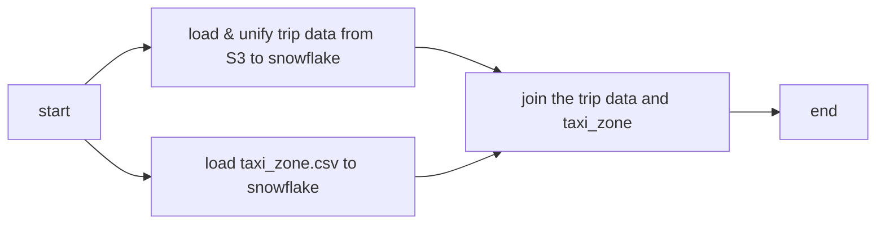

# NYC-TLC DEMO

A data pipe line demo with NYC-TLC data, doing ELT from AWS S3 to Snowflake and using Airflow to monitoring all the tasks.

## Project Structure

```
nyc-tlc-airflow-demo
├───secrects.json
├───airflow/
|   ├───.env
│   └───dags/
│       └───sql
├───crawler/
└───sql-files/
```

- `secrects.json`: containg the secrects crediential of Snowflake and AWS
- `airflow/`: containing all the files about the airflow service. using `docker-compose.yaml` the setup the airflow environment
- `airflow/.env`: containg all the secrect information airflow container needed
- `airflow/dags/`: airflow DAG dir. connected with docker volumn
- `airflow/dags/sql/`: containing all the SQLs which the DAG needs.
- `crawler/`: containg a crawler (`prepare_data.py`) and a `Pipfile` for its python environment
- `sql-files/`: containing a bunch of testing sqls which may and maynot directly related to the project.

## Run

### Prerequisites

Packages:

- pipenv
- docker compose

Platforms:

- Snowflake Account & AWS Account
- A AWS IAM role for S3 bucket crawler access
- Snowflake Storage Ingestion with AWS S3 bucekt

Optional:

- A separeate AWS IAM role for Snowflake connection (can just use the same one as the crawler one)
- A AWS EC2 for running the Airflow service (can also be done on local machine)

### Set-ups

- prepare the cridientials in `secrets.json`
- set up the snowflake connection with AWS S3
    - you can follow [this guide](https://docs.snowflake.com/en/user-guide/data-load-s3-config)
- run the crawler `crawler/prepare_data.py` to upload the _NYC-TLC_ data to S3 bucket
- run the `airflow/conn_uri_gen.py` and copy the secret uri to `airflow/.env`

### Build & Run

Init the Airflow

```shell
# inside ./airflow dir
docker compose up airflow-init
```

Start the Airflow service

```shell
# use -d option for background execcution
docker compose up
```

And thats it! Every thing should be up and running.

The Airflow Webserver should be visible at `localhost:8080` by default

For more information about the Airflow with docker compose see: [airflow/howto/docker-compose](https://airflow.apache.org/docs/apache-airflow/stable/howto/docker-compose/index.html)

## NYC-TLC Data

[nyc.gov tlc trip data page](https://www.nyc.gov/site/tlc/about/tlc-trip-record-data.page)

### Data Format

As yellow_tripdata as examples, the column naming had been changed through several times.
Like: `VENDOR_ID` `VENDORNAME` `VENDORID`.

All the data start using location id insteand actual lat and lon around 2015.

More information about the data can be found on [nyc official website](https://www.nyc.gov/site/tlc/about/tlc-trip-record-data.page)

## S3 bucket structure

I fetch the files from [nyc offical website](https://www.nyc.gov/site/tlc/about/tlc-trip-record-data.page) via my script 
`crawler/prepare_data.python`

The reslut will be looks like something like this:

```
nyc-tlc-demo
├── taxi_zone_lookup.csv
└── trip-data
    ├── yellow
    │   ├── yellow_tripdata_2009-01.parquet
    │   └── ...
    ├── green
    │   ├── green_tripdata_2014-01.parquet
    │   └── ...
    ├── fhv
    │   ├── fhv_tripdata_2015-01.parquet
    │   └── ...
    └── fhvhv
        ├── fhvhv_tripdata_2019-02.parquet
        └── ...
```

## Workflow



### Compare

Method1: Copy data from external table

```
copy_from_s3: from external table to table
transformation 1: unify the column naming
transformation 2: join taxi_zone_lookup with locationID
merge_all_table: merge all from yellow, green, fhv
```

Method2: Copy file to internal stage first, then create table from internal stage

```
copy file to internal stage from external stage
create table from internal stage
transformation 1: unify the column naming
transformation 2: join taxi_zone_lookup with locationID
merge_all_table: merge all from yellow, green, fhv
remove file in local stage
```

use `sql-files/query_query_history.sql` to see the query execution time and compare the two methods.